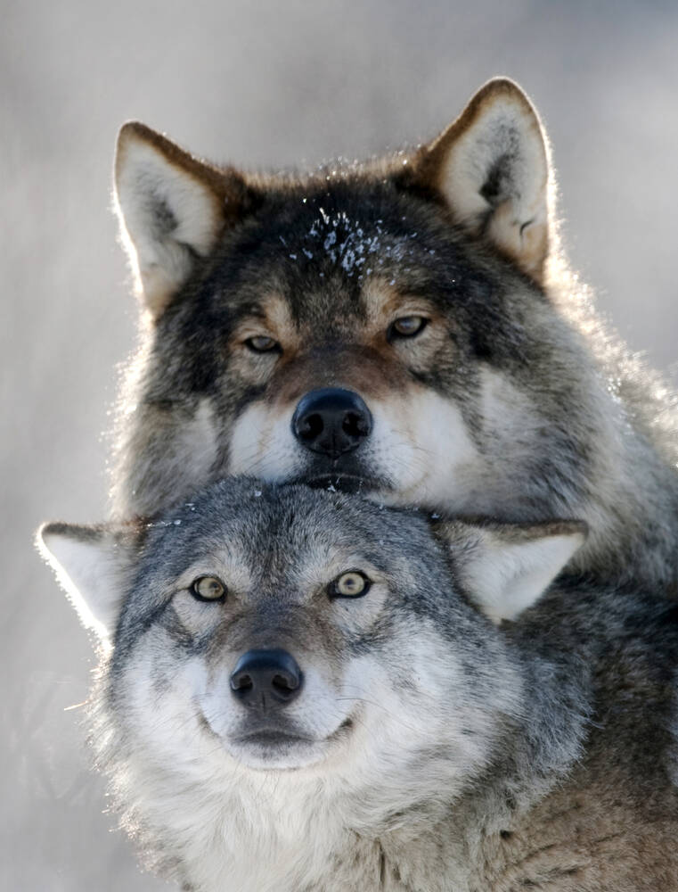
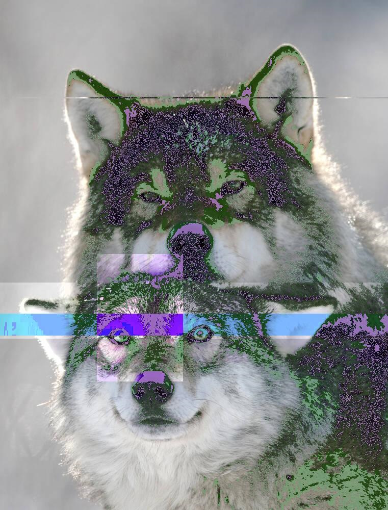
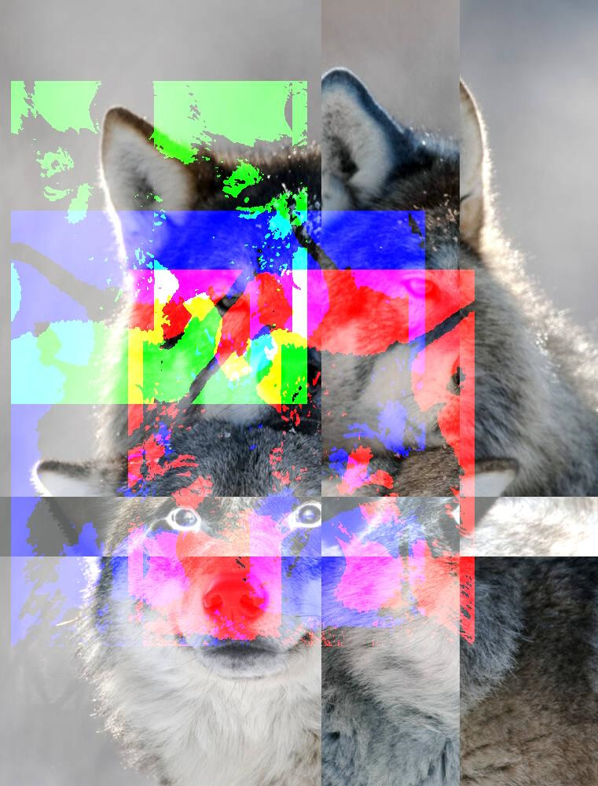
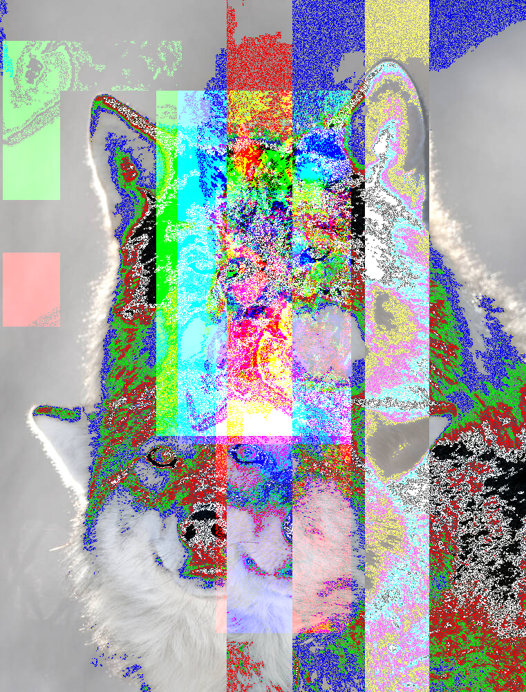
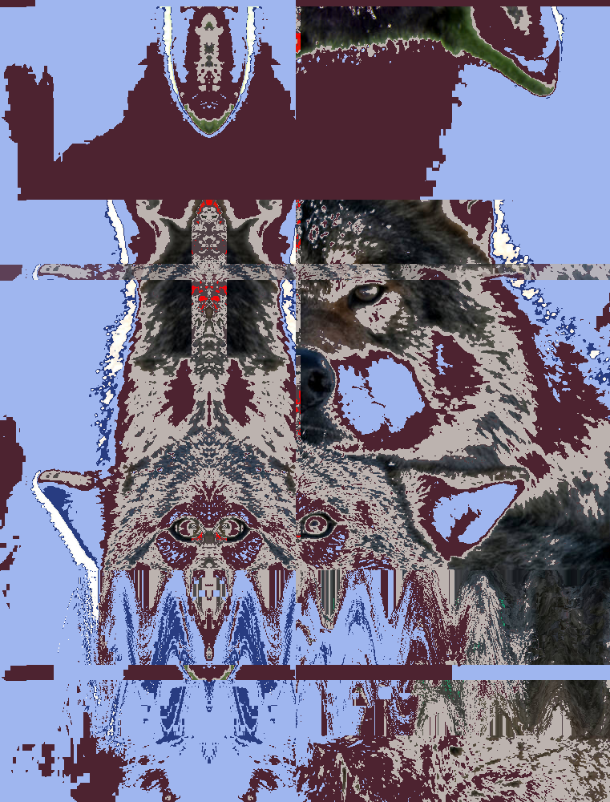

# pybend
an image-data manipulation tool for creating glitch-art/databend effects with a single click, inspired by sonification


## about
pybend is a python-based application that treats images as raw data, applying distortions to create controlled glitch art. it allows you to manipulate images in ways similar to how data can be "bent" in applications like audacity

<div align="center">
  <table>
    <tr>
      <td align="center"><b>original</b></td>
      <td align="center"><b>intensity: 25%</b></td>
      <td align="center"><b>intensity: 50%</b></td>
      <td align="center"><b>intensity: 75%</b></td>
      <td align="center"><b>intensity: 100%</b></td>
    </tr>
    <tr>
      <td></td>
      <td></td>
      <td></td>
      <td></td>
      <td></td>
    </tr>
  </table>
</div>

## features
- 10 glitch effects
- intuitive interface with realtime previews
- highly optimized performance processing using numba for jit compilation

## installation (requires python)
```bash
# clone the repository
git clone https://github.com/stateflux/pybend.git
cd pybend

# install dependencies
pip install -r requirements.txt

# run the application
py bend.py
```

## usage
1. launch the application (first init can be slow as numba compiles)
2. drag and drop an image onto the interface
3. change effect intensity to achieve desired results
4. save your creation(s) when satisfied

## effects
pybend includes several effects for image manipulation:

- **color-range shifter**: shifts specific color ranges to create unique distortions
- **chunk duplication**: duplicates chunks of image data for fragmented effects
- **phantom regions**: extracts single-channel data to impose ghost-like artifacts upon the image
- **palette swap**: remaps colors for dramatic transformations
- **zeta inverse**: applies mathematical transformations to pixel data (bloated inversion, but it looks 10x cooler)
- **wave propagation**: creates wavelike distortions across the image
- **selective channel corruption**: corrupts specific rgb channels
- **bitdepth reduction**: reduces bit depth for pixelation and color banding
- **reverser**: reverses data segments
- **mirror**: creates mirror effects

## dependencies
- python 3.6+
- pyqt5
- numba
- numpy
- pillow

## todo:
- perf:
    - pytorch (cuda) support for O(1) timeline processing when i get my 3070 (this is probably never happening)
    - another perf (maybe refactor) pass of palette_swap, color_range_shift, zeta, phantom_regions
    - fix palette_swap compiler nonsense, more robust gc handling

- general:
    - add cooler effects: context-aware fill/smear (high prio), radial fx, something fractals, wahwah
    - more intuitive intensity-scaled fx selector and probably intensity scale as a whole
    - gif/webp support
    - flask

- improve ux:
    - pypi packaging
    - higher user autonomy (fx selector, strength settings)
    - cleaner init (pyinstaller)
    - icon
    - ability to use glitched image as source with button (reglitch)
    - examples of what each effect actually does on its own
    - disclaimer for images >10mp

## license
*[MIT](LICENSE)*

jump in if you wanna help - all contributions welcome

<p align="center"><em>built with ♥ and an appreciation for digital imperfection</em></p>